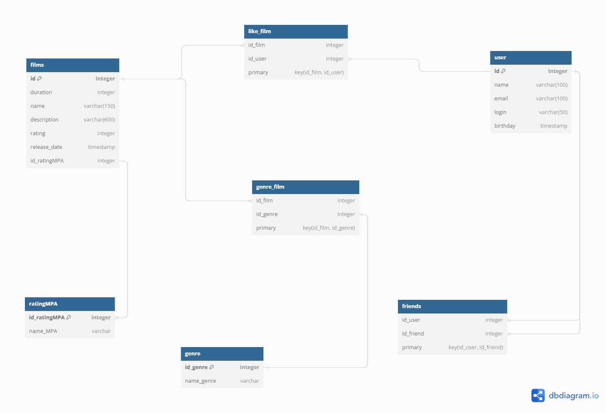

# java-filmorate


Описание функционала программы
Приложение для организации совместной работы над задачами. Программа позволяет выполнять CRUD-операции над задачами. Сами задачи делятся на разные типы: общие, подзадачи и эпики. Эпики включают в себя подзадачи. Функционал программы реализован в трех формах:

сохранение данных в оперативной памяти на локальной машине,
сохранением данных в файл на локальной машине,
сохранение данных в файл на сервере с использованием клиента.

## Схема базы данных



## Описание схемы

Схема базы данных представлена выше. Она состоит из нескольких таблиц, таких как `films`, `users`, `like_film` и т.д.,
связанных между собой через внешние ключи.

## Примеры запросов

### Получение списка всех фильмов

**URL:** `http://localhost:8080/films`
**Метод:** `GET`

### Добавление нового фильма

**URL:** `http://localhost:8080/films`
**Метод:** `POST`
**Тело запроса:**

```json
{
  "duration": 120,
  "name": "Название фильма",
  "description": "Описание фильма",
  "release_date": "2023-07-01T00:00:00Z",
  "id_ratingMPA": 1
}
```

### Получение информации о фильме по его ID

**URL:** `http://localhost:8080/films/{id}`
**Метод:** `GET`

### Обновление информации о фильме

**URL:** `http://localhost:8080/films/{id}`
**Метод:** `PUT`
**Тело запроса:**

```json
{
  "id": 1,
  "duration": 130,
  "name": "Измененное название фильма",
  "description": "Измененное описание фильма",
  "release_date": "2023-07-01T00:00:00Z",
  "id_ratingMPA": 2
}
```

### Удаление фильма по его ID

**URL:** `http://localhost:8080/films/{id}`
**Метод:** `DELETE`

### Поставить лайк фильму

**URL:** http://localhost:8080/films/{id}/like/{userId}
**Метод:** `PUT`

### Убрать лайк с фильма

**URL:** `http://localhost:8080/films/{id}/like/{userId}`
*Метод:* `DELETE`
